# LR6
Лабораторная работа №6
*В2441 Федотов Е. А.*

## **Цель лабораторной работы:**
*Изучение базовых возможностей системы управления версиями, опыт работы с Git Api, опыт работы с локальным и удаленным репозиторием.*

## **Решение:**

**4. Настройка клиента git, ввод имени, email.**
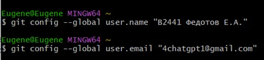

**5. Клонирование своего удалённого репозитория на компьютер**
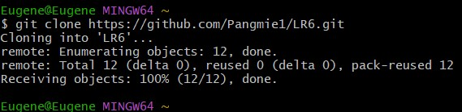

**6. Добавление файла через интерфейс GitHub. Подтягивание изменения в локальный репозиторий.**
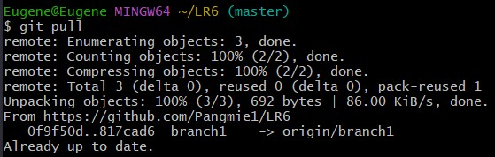

**7. Получение истории операций для каждой из веток.**
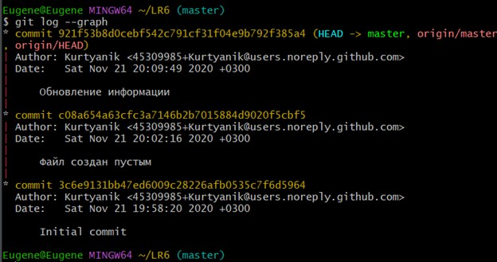

**8. Просмотреть последние изменения.**
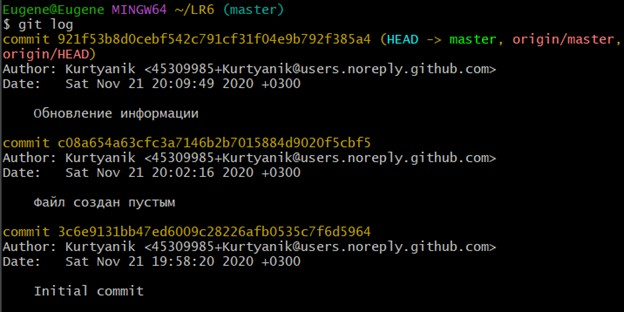

**9. Выполнить слияние в ветку master, разрешив конфликт.**
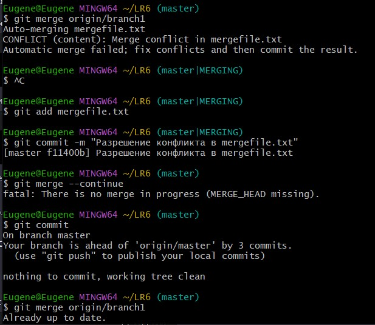

**10. Удалить побочную ветку.**

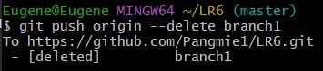

**11. Сделать изменения и зафиксировать их, оставляя комментарии несколько раз.**
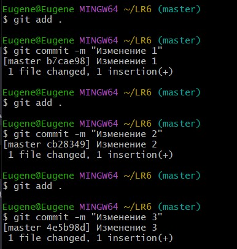

**12. Сделать откат коммита.**
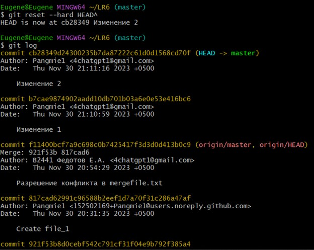

**13. Создать ветку для отчёта.**

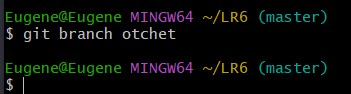

**14. Начать оформлять отчет.**
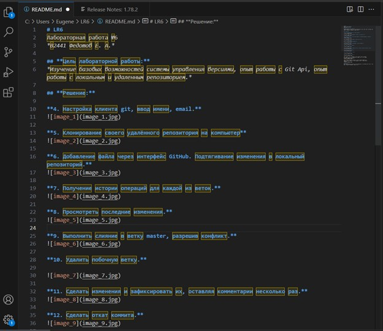

**15. Получить историю операций в форматированном виде (сокращённый
хэш + дата + имя автора + комментарий). Добавить её в отчёт и сделать
финальную фиксацию изменений.**
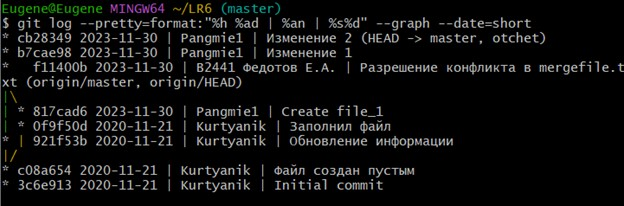

**16. Отправить локальные изменения в сетевое хранилище GitHub (если
делаете работу постепенно, то синхронизацию проводить в конце рабочего
сеанса)** 
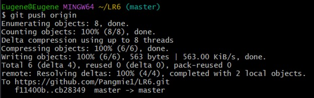

## **Вывод:**
*Были изучены базовые возможности системы управления версиями,получен опыт работы с Git Api, с локальным и удаленным репозиторием.*
